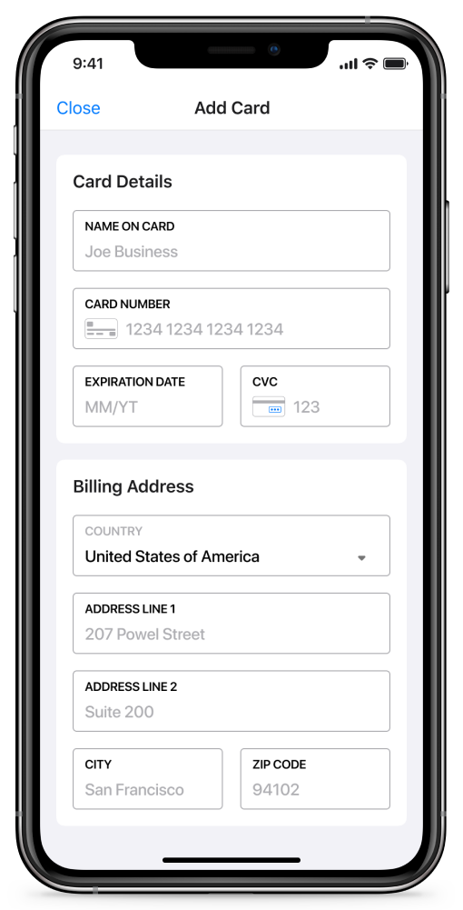
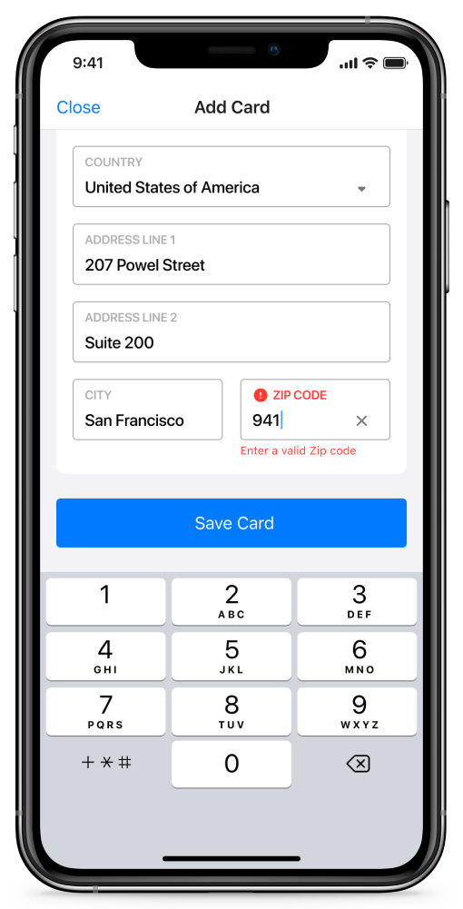

[](https://circleci.com/gh/verygoodsecurity/vgs-checkout-ios/tree/main)
[]()
[](./LICENSE)
[]()

# VGS Checkout iOS SDK

VGS provides you with a Universal Checkout and User Experience which is fully integrated with our payment optimization solution. We offer a single, customized, consistent experience to your customers across devices and browsers that you control. Provide a unified experience with all the features you want and no compromises to ensure your customers have the best experience with no distractions.

<p align="center">
  
  
</p>

**Depending on the needs we provide you with two solutions:**

-  **Customized Universal Checkout** - shape the solution you need with our universal checkout solution. It’s easy to customize your integration with no heavy lifting to have a uniform experience across platforms and devices.<br/>
-  **Checkout for Payment Orchestration** - save time and payment costs on by integration with [Multiplexing App](https://www.verygoodsecurity.com/docs/payment-optimization/multiplexing).

Table of contents
=================

<!--ts-->
   * [Before you start](#before-you-start)
   * [Integration](#integration)
      * [CocoaPods](#cocoapods)
      * [Swift Package Manager](#swift-package-manager) 
   * [Usage](#usage)
      * [Checkout SDK Configuration](#choose-checkout-sdk-configuration)
      * [Present Checkout](#present-vgscheckout-form-with-configuration-object)
   * [Demo Application](#demo-application)
   * [Documentation](#documentation)
   * [Releases](#releases)
   * [Dependencies](#dependencies)
   * [License](#license)
<!--te-->


## Before you start
You should have your organization registered at <a href="https://dashboard.verygoodsecurity.com/dashboard/">VGS Dashboard</a>. Sandbox vault will be pre-created for you. You should use your `<vaultId>` to start collecting data. Follow integration guide below.

# Integration

### CocoaPods

[CocoaPods](https://cocoapods.org) is a dependency manager for Cocoa projects. For usage and installation instructions, visit their website. To integrate VGSCheckoutSDK into your Xcode project using CocoaPods, specify it in your `Podfile`:

```ruby
pod 'VGSCheckoutSDK'
```

### Swift Package Manager

The [Swift Package Manager](https://swift.org/package-manager/) is a tool for automating the distribution of Swift code and is integrated into the `swift` compiler.
Xcode with Swift tools version of 5.3 is required for VGSCheckoutSDK. Earlier Xcode versions don't support Swift packages with resources.
To check your current Swift tools version run in your terminal:

```ruby
xcrun swift -version
```

> NOTE: In some cases you can have multiple Swift tools versions installed.


Follow the official Apple SPM guide [instructions](https://developer.apple.com/documentation/xcode/adding_package_dependencies_to_your_app) for more details.\n  
To use Swift Package Manager, in Xcode add the https://github.com/verygoodsecurity/vgs-checkout-ios.git dependency.


## Usage

### Import VGSCheckoutSDK into your project
```swift
import UIKit
import VGSCheckoutSDK

class ViewController: UIViewController {

  /// VGS Checkout object
  var vgsCheckout: VGSCheckout?
  
}
```

### Choose Checkout SDK Configuration
VGS Checkout SDK works with different configuration types. You can get more info about available configrurations in VGS Checkout SDK [docs](https://www.verygoodsecurity.com/docs/payment-optimization/checkout/ios-sdk/configuration).

***VGSCheckoutMultiplexingAddCardConfiguration setup***<br/>

`VGSCheckoutMultiplexingAddCardConfiguration` requires valid access token for [Multiplexing App](https://www.verygoodsecurity.com/docs/payment-optimization/multiplexing).
 Use your `tenantId` for payment orchestration. You can get it in your [organisation dashboard].

```swift
// Create multiplexing add configuration with access token.
VGSCheckoutMultiplexingAddCardConfiguration.createConfiguration(accessToken: "<MULTIPLEXING_ACCESS_TOKEN>", tenantId: "<TENANT_ID>", environment: "<ENVIRONMENT>") {[weak self] configuration in
		guard let strongSelf = self else {return}
		configuration.billingAddressVisibility = .visible
		
		strongSelf.vgsCheckout = VGSCheckout(configuration: configuration)
		strongSelf.vgsCheckout?.delegate = strongSelf
		// Present checkout configuration.
		strongSelf.vgsCheckout?.present(from: strongSelf)
} failure: {[weak self] error in
		print(error.localizedDescription)
		print("ERROR! Cannot create multiplexing configuration!")
}

```

***VGSCheckoutCustomConfiguration setup***<br/>

Use your `vaultId` to initialize `VGSCheckoutCustomConfiguration` instance. You can get it in your [organisation dashboard](https://dashboard.verygoodsecurity.com/).

```swift
/// Create VGSCheckoutCustomConfiguration instance with vaultID and environment
var checkoutConfiguration = VGSCheckoutCustomConfiguration(vaultID: "<VAULT_ID>",
                                                       environment: "<ENVIRONMENT>")

/// Set field names
checkoutConfiguration.cardNumberFieldOptions.fieldName = "card_number"
checkoutConfiguration.billingAddressCountryFieldOptions.fieldName = "billing_address.country"
//... 

/// Show billing address section
checkoutConfiguration.billingAddressVisibility = .visible

/// Set request path
checkoutConfiguration.routeConfiguration.path = "/post"

/// Add extra data to request
checkoutConfiguration.routeConfiguration.requestOptions.extraData = ["<Custom Key>": "<Custom Value>"]

/// Set custom request headers
checkoutConfiguration.routeConfiguration.requestOptions.customHeaders = ["<Header Key>": "<Header Value>"]
```

### Present VGSCheckout Form with Configuration object

```swift
/// Init VGSCheckout with Configuration object.
vgsCheckout = VGSCheckout(configuration: checkoutConfiguration)

/// Present VGSCheckout Form
vgsCheckout?.present(from: self)
```


## Demo Application
Demo application with different Checkout Configurations <a href="./VGSCheckoutDemoApp">here</a>.

### Documentation
-  SDK Documentation: https://www.verygoodsecurity.com/docs/payment-optimization/checkout/ios-sdk/
-  API Documentation: https://verygoodsecurity.github.io/vgs-checkout-ios/

### Releases
To follow `VGSCheckoutSDK` updates and changes check the [releases](https://github.com/verygoodsecurity/vgs-checkout-ios/releases) page.

### Metrics
VGSCheckoutSDK tracks a few key metrics to understand SDK features usage, which helps us know what areas need improvement. No personal information is tracked.
You can easily opt-out of metrics collection in `VGSCheckoutAnalyticsClient`:
```
VGSCheckoutAnalyticsClient.shared.shouldCollectAnalytics = false
```

## Dependencies
- iOS 11+
- Swift 5

## License

 VGSCheckout iOS SDK is released under the MIT license. [See LICENSE](./LICENSE) for details.

